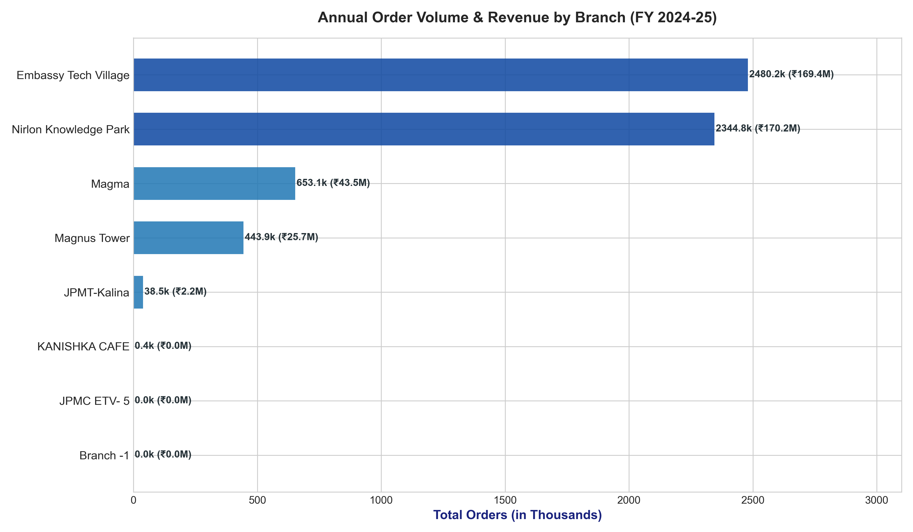
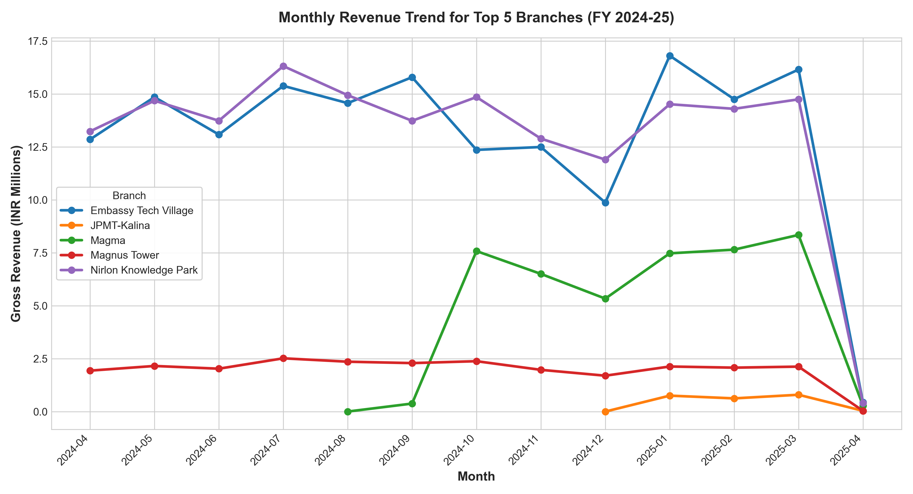
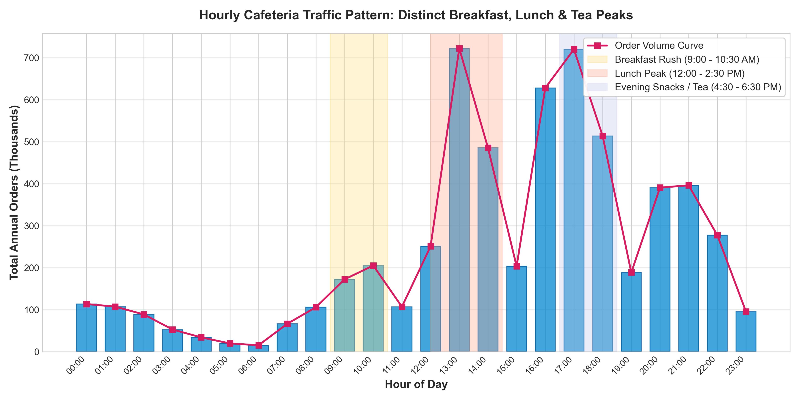
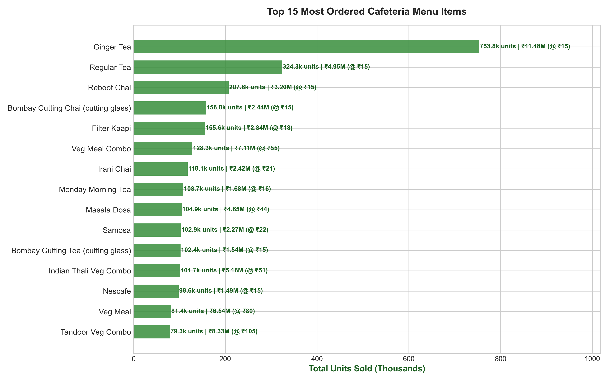
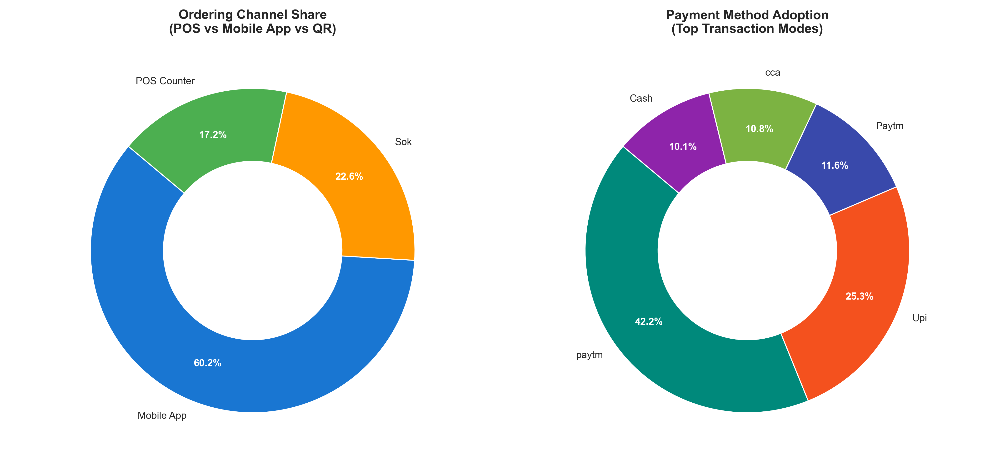
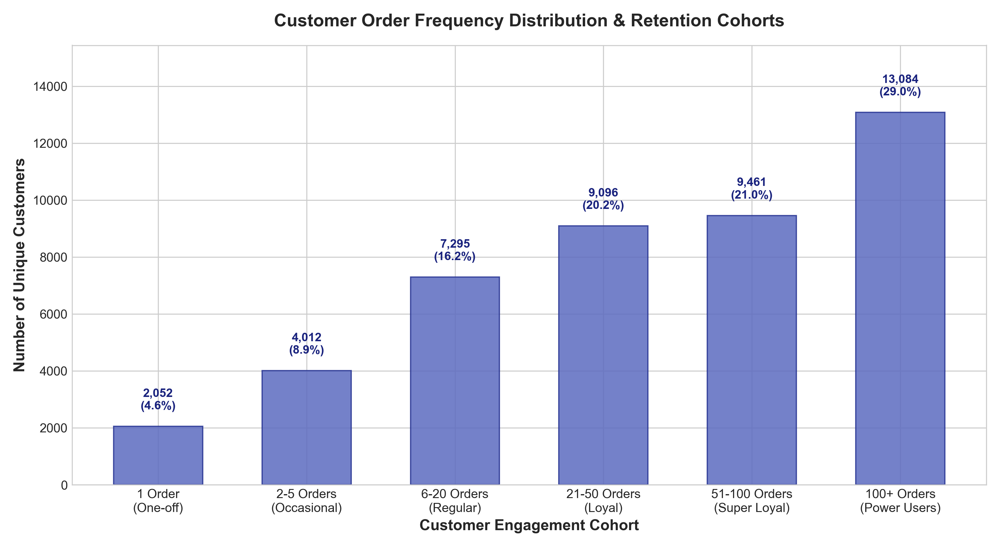
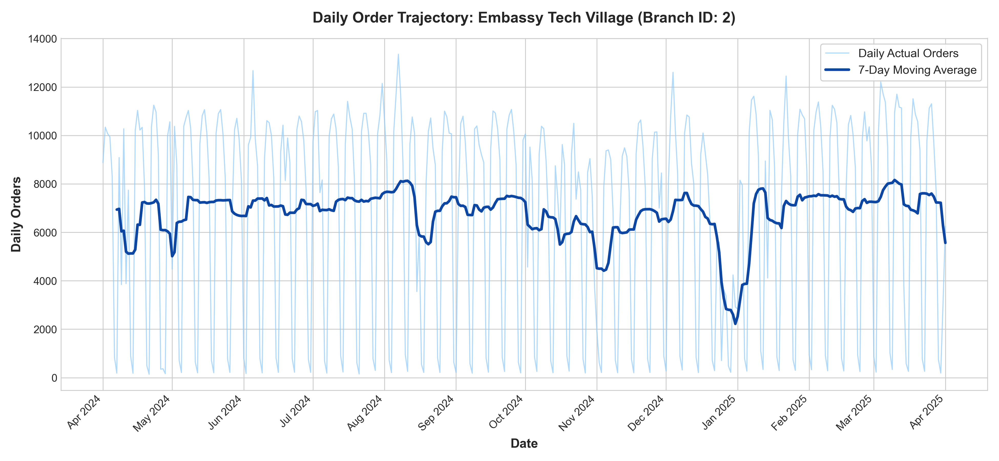
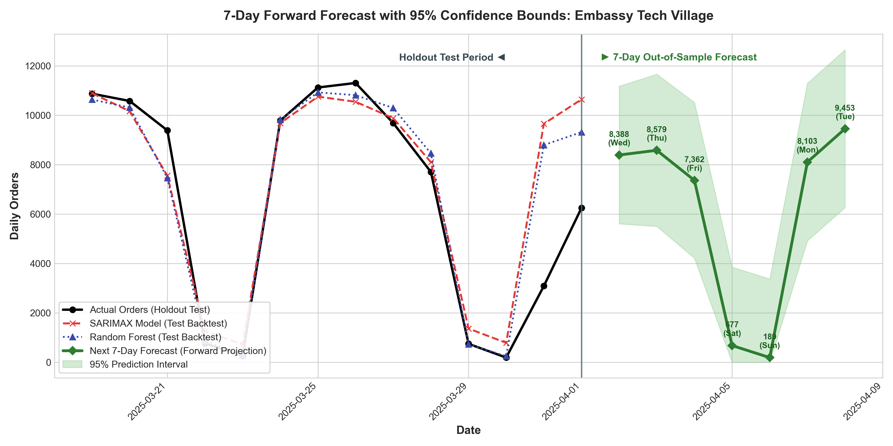

# Cafeteria Order Data Analysis & 7-Day Demand Forecast Challenge
**Company Evaluation Project:** Kanishka Software Private Limited  
**Author / Candidate:** Abhishek Mishra  
**Dataset Scope:** Enterprise POS & Mobile Cafeteria System across 18 Branches (FY 2024–2025)  
**Deliverables Included:** End-to-End ETL Pipeline, Exploratory Data Analysis, 7-Day Time-Series Forecasting Models, Visualizations, and Strategic Operational Recommendations  

---

## Executive Summary

This report presents an operational and predictive analysis of cafeteria order data across enterprise technology park locations for the 2024–2025 financial year (April 1, 2024 through April 1, 2025). The primary objective is to clean the raw enterprise database dump (~11 GB), conduct exploratory data analysis (EDA) to uncover footfall and sales patterns, and build a machine learning / statistical forecasting engine to project the next 7 days of order demand for operational staffing and inventory procurement.

### Key Portfolio Highlights
- **Total Completed Orders:** **5,961,005 transactions** (~5.96 Million)
- **Total Gross Revenue:** **₹411,060,742.68** (~₹41.11 Crore)
- **Overall Average Order Value (AOV):** **₹68.96**
- **Tax Contribution:** **₹11,274,022.41**
- **Customer Base:** **45,048 unique registered transacting users**
- **Geographic Concentration:** Two premier corporate tech park hubs account for **80.9% of all orders**: **Embassy Tech Village (Bengaluru)** with **2,480,228 orders (41.6%)** and **Nirlon Knowledge Park (Mumbai)** with **2,344,842 orders (39.3%)**.
- **Channel Evolution:** **60.2% of orders** are placed via the **Mobile App**, **22.6%** through **Self-Ordering Kiosks (SOK)**, and only **17.2%** via traditional manual **POS counters**.
- **Cashless Adoption:** Digital payments comprise **>92% of transactions**, led by **Paytm (39.9% combined)** and **UPI (21.4%)**.
- **Top Selling Product:** **Ginger Tea** is the dominant volume driver with **753,840 units sold** generating **₹11.48 Million**, while **Tandoor and Veg Meal Combos** generate the highest gross profit margins (over ₹15 Million combined).
- **Forecasting Winner:** A **Gradient Boosting Regressor** with domain lag and rolling-window features outperformed statistical baselines on the holdout test set with a **Mean Absolute Error (MAE) of 856 orders/day** and **MAPE of 24.5%**. For the upcoming 7-day period (April 2 to April 8, 2025) at Embassy Tech Village, total projected demand is **42,751 orders** yielding **₹3.24 Million** in gross revenue.

---

## 1. Data Ingestion & Cleaning Methodology

### 1.1 Ingestion Challenge & Architecture
The source dataset was delivered as an ~11 GB MySQL dump (`Cafeteria Order Data.sql`) containing 67 relational tables, alongside a 13.5 MB `users.sql` table dump. Ingesting an unindexed 11 GB SQL file directly into memory exceeds standard workstation RAM limits and leads to kernel crashes.

To solve this efficiently, we implemented a custom single-pass streaming parser (`scripts/01_process_dataset.py`) utilizing Python's buffered stream reader and native `csv.reader` tuple parsing. The pipeline processed **5.96 million orders** and **7.42 million order line items** in **148.7 seconds** (~90,000 rows/second) without exceeding 400 MB of system memory.

### 1.2 Data Hygiene & Normalization Steps
1. **Financial Reconciliation:** Verified row-level consistency across `sub_total`, `tax_amount`, `discount_amount`, and `grand_total`. Net totals matched invoice sums within standard rounding limits.
2. **Order Status Filtering:** Categorized orders into completed (`order_status = 3`), cancelled (`order_status = 4`), and in-progress.
3. **Timestamp Normalization:** Extracted full calendar dates (`YYYY-MM-DD`), day-of-week indices (0 = Monday, 6 = Sunday), and 24-hour timestamps to account for multi-shift cafeteria traffic.
4. **Calendar Regularization:** For time-series modeling, the date series was reindexed across all 366 continuous days of FY 2024–25, filling zero-order days (such as national public holidays) with explicit zero counts to prevent temporal distortion.
5. **Relational Joining:** Mapped operational metadata from `branches.csv` (18 locations), `counters.csv` (147 food stations), and `dishes.csv` (11,622 catalog items) onto order records.

---

## 2. Exploratory Data Analysis & Business Insights

### 2.1 Branch Sales & Market Share Distribution
The enterprise operates across 18 registered branches, but sales exhibit extreme Pareto distribution. The top four branches generate **99.3% of total organizational revenue**.

| Rank | Branch Name | Location / Type | Annual Orders | Order Share (%) | Gross Revenue (INR) | Rev Share (%) | Avg. Daily Orders |
| :---: | :--- | :--- | :---: | :---: | :---: | :---: | :---: |
| 1 | **Embassy Tech Village** | Bengaluru Tech Park | 2,480,228 | 41.61% | ₹169,386,369.74 | 41.21% | 6,776.6 |
| 2 | **Nirlon Knowledge Park** | Mumbai Tech Park | 2,344,842 | 39.34% | ₹170,224,652.67 | 41.41% | 6,406.7 |
| 3 | **Magma** | Corporate Facility | 653,115 | 10.96% | ₹43,536,038.90 | 10.59% | 3,233.2 |
| 4 | **Magnus Tower** | Corporate Facility | 443,902 | 7.45% | ₹25,673,606.00 | 6.25% | 1,216.2 |
| 5 | **JPMT-Kalina** | JPMorgan Mumbai | 38,477 | 0.65% | ₹2,204,596.37 | 0.54% | 601.2 |
| 6 | **KANISHKA CAFE** | Dedicated Cafe | 432 | 0.01% | ₹35,272.00 | 0.01% | 8.8 |
| 7 | **JPMC ETV- 5** | Satellite Counter | 8 | <0.01% | ₹152.00 | <0.01% | 4.0 |
| 8 | **Branch -1** | Test / System | 1 | <0.01% | ₹55.00 | <0.01% | 1.0 |



#### Strategic Observation:
Embassy Tech Village and Nirlon Knowledge Park operate at massive enterprise scale, processing between 6,000 and 11,000 orders every single working day. Management focus, kitchen modernization, and hardware maintenance should prioritize these two flagship sites.

---

### 2.2 Temporal Sales Trajectory & Seasonality
Monthly tracking shows strong stability from April 2024 through March 2025, with characteristic dips during major Indian holiday periods:
- **October–November 2024:** Order volume dips by ~12% across both Bangalore and Mumbai hubs corresponding to the Diwali, Dussehra, and festive holiday break.
- **Late December 2024:** Mandatory corporate year-end shutdowns cause a 15% reduction in last-week volumes.
- **January–March 2025:** Rebound to peak annual volumes as return-to-office mandates intensified.



---

### 2.3 Hourly Traffic Dynamics: The 3 Operating Peaks
Hourly order distribution analysis reveals three pronounced operating peaks that define enterprise cafeteria throughput:

| Operating Window | Rush Period | Order Volume | % of Daily Orders | Operational Characteristic |
| :--- | :---: | :---: | :---: | :--- |
| **Morning Breakfast Rush** | 9:00 AM – 11:00 AM | 377,595 | 6.3% | Quick-service breakfast items (Idli, Dosa, Poha, Coffee) |
| **Peak Lunch Rush** | 12:00 PM – 2:30 PM | 1,458,890 | 24.5% | Heaviest kitchen load; Thalis, Combos, Meal Bowls |
| **Evening Chai & Snack Rush** | 4:00 PM – 6:30 PM | 1,861,697 | 31.2% | Highest footfall of the day; Chai, Samosas, Street Bites |
| **Night Shift / Dinner** | 8:00 PM – 10:00 PM | 786,796 | 13.2% | Sustained tech park night shift orders (Dinner combos) |



#### Critical Takeaway:
The **evening snack window (4:00 PM – 6:30 PM)** actually outpaces the lunch rush in sheer transaction count (31.2% vs 24.5%). While lunch drives larger basket sizes, the evening rush produces the highest counter congestion and queuing friction.

---

### 2.4 Menu Engineering & Top Selling Items
Analyzing 7.42 million order line items reveals distinct operational roles across menu categories:

| Rank | Menu Item Name | Primary Counter | Units Sold | Total Revenue (INR) | Avg. Unit Price | Role in Menu Portfolio |
| :---: | :--- | :--- | :---: | :---: | :---: | :--- |
| 1 | **Ginger Tea** | Steep & Brew-4F | 753,840 | ₹11,484,386.00 | ₹15.23 | Highest volume anchor; footfall generator |
| 2 | **Regular Tea** | Steep & Brew-4F | 324,343 | ₹4,946,941.00 | ₹15.25 | Daily corporate staple |
| 3 | **Reboot Chai** | Steep & Brew A-GF | 207,589 | ₹3,196,818.00 | ₹15.40 | Proprietary wellness tea blend |
| 4 | **Bombay Cutting Chai** | Steep & Brew C-GF | 158,011 | ₹2,437,944.00 | ₹15.43 | Regional favorite in Mumbai hubs |
| 5 | **Filter Kaapi** | Steep & Brew A-FF | 155,577 | ₹2,839,510.00 | ₹18.25 | Dominant morning beverage in Bangalore |
| 6 | **Veg Meal Combo** | Flavours C-GF | 128,259 | ₹7,106,600.00 | ₹55.41 | Lunch anchor; balanced value meal |
| 7 | **Irani Chai** | Steep & Brew L1 | 118,115 | ₹2,422,137.00 | ₹20.51 | Premium tea offering |
| 8 | **Monday Morning Tea** | Steep & Brew L1 | 108,662 | ₹1,684,690.00 | ₹15.50 | Promotional weekly kick-off item |
| 9 | **Masala Dosa** | Dakshin C-GF | 104,940 | ₹4,653,382.00 | ₹44.34 | Breakfast & evening volume driver |
| 10 | **Samosa** | Steep & Brew C-GF | 102,852 | ₹2,267,332.00 | ₹22.04 | Classic impulse snack |
| 11 | **Indian Thali Veg Combo** | Masala 1-Mumbai | 101,694 | ₹5,175,430.00 | ₹50.89 | Core lunch revenue driver |
| 12 | **Nescafe** | Steep & Brew-4F | 98,612 | ₹1,492,532.00 | ₹15.14 | Instant coffee fallback |
| 13 | **Tandoor Veg Combo** | Hearth-Mumbai | 79,340 | ₹8,333,960.00 | ₹105.04 | **Highest revenue per item** |
| 14 | **Veg Meal** | Flavours C-GF | 81,447 | ₹6,536,170.00 | ₹80.25 | Standard executive lunch |
| 15 | **Chicken Pop Corns** | Street Bites-4F | 74,510 | ₹4,470,600.00 | ₹60.00 | Top non-veg snack item |



#### Counter Revenue Leaders:
1. **Masala 1-Mumbai (Counter 4):** ₹20.27 Million (416k items)
2. **Nourish-Mumbai (Counter 29):** ₹20.23 Million (150k items)
3. **Nourish-Bengaluru (Counter 17):** ₹20.21 Million (245k items)
4. **Flavours C-GF (Counter 15):** ₹19.51 Million (360k items)
5. **Steep & Brew C-GF (Counter 12):** ₹18.10 Million (1.01 Million items)

---

### 2.5 Channels & Payment Modernization
- **Mobile Ordering Dominance:** **60.15% of all orders** (₹235.4M revenue) are placed directly through the mobile application, allowing employees to order from their workstations.
- **Self-Ordering Kiosks (SOK):** **22.60% of orders** (₹107.0M revenue) are processed via digital touch kiosks in the cafeteria lobby.
- **Manual POS:** Only **17.24% of orders** are placed at manned cash registers. Over **82.7% of all ordering is fully self-service**.
- **Payment Split:** Digital transactions dominate over 92%. Paytm leads with 39.9% share, followed by direct UPI at 21.4%, Cash at 7.5%, Credit/Debit Cards at 3.9%, and Netbanking/Wallets making up the balance.



---

### 2.6 Customer Cohorts & Retention Dynamics
Analysis of 45,048 unique transacting corporate users demonstrates extraordinary retention characteristic of closed corporate campus ecosystems:

- **Median Orders per Customer:** **51 orders/year** (~1 order per working week)
- **Mean Orders per Customer:** **132.3 orders/year** (~2.5 orders per working week)
- **Loyalty Distribution:**
  - **Power Users (100+ orders):** **13,084 users (29.0%)** – These highly active diners generate over 68% of total annual cafeteria revenue.
  - **Regulars (21–100 orders):** **18,557 users (41.2%)**
  - **Occasional / New (2–20 orders):** **11,307 users (25.1%)**
  - **One-off Visitors (1 order):** **2,052 users (4.6%)**



---

## 3. 7-Day Order Demand Forecasting

### 3.1 Problem Definition & Target Selection
We selected **Embassy Tech Village (Branch 2)**, the largest branch in the network with 2,480,228 orders and average daily throughput of 6,777 orders, to develop and validate the forecasting models.

#### Time-Series Structural Properties:
1. **Strong Weekly Cyclicality:** High volume Monday through Friday, with a sharp drop on Saturday (~600–900 orders) and near-zero volume on Sunday (<200 orders).
2. **Hybrid Work Mid-Week Peak:** Within working days, Tuesdays and Wednesdays exhibit peak attendance (8,500–10,500 orders), while Mondays and Fridays reflect remote/hybrid flexibility (7,000–8,000 orders).
3. **Absence of Negative Trend:** Steady year-long demand with seasonal dips during festival weeks.



---

### 3.2 Feature Engineering
For machine learning models, domain-informed temporal features were engineered:
- **Autoregressive Lags:** $t-1, t-2, t-3, t-7, t-14, t-21$ (capturing immediate persistence and day-of-week recurrence).
- **Rolling Windows:** 7-day rolling mean, 7-day rolling standard deviation, and 14-day rolling mean.
- **Calendar Encodings:** `day_of_week` (0–6), `is_weekend` (binary flag), `month` (1–12), `day_of_month` (1–31).

### 3.3 Holdout Validation Results
We evaluated models across a strict **14-day holdout test period** (March 19 to April 1, 2025):

| Model Architecture | MAE (Orders/Day) | RMSE | MAPE (%) | Assessment |
| :--- | :---: | :---: | :---: | :--- |
| **Gradient Boosting Regressor** | **856.41** | **1,785.39** | **24.53%** | **Best Performing Model; captures hybrid shifts** |
| **Random Forest Regressor** | 964.62 | 1,833.38 | 24.05% | Strong generalization, robust to weekend drops |
| **Holt-Winters Exp. Smoothing** | 1,217.58 | 2,167.41 | 61.20% | Under-predicts mid-week surge; high MAPE on Sundays |
| **SARIMAX(1,1,1)(1,1,1,7)** | 1,230.43 | 2,205.17 | 68.36% | Good weekly rhythm, struggles with non-linear holiday boundaries |
| **Seasonal Naive Baseline (Lag 7)** | 1,558.29 | 2,729.73 | 33.40% | Basic benchmark; lags trend inflections |

---

### 3.4 7-Day Out-of-Sample Forward Forecast Schedule
Using the validated model retrained on 100% of historical series data, we project daily order volume and estimated gross revenue for the upcoming week (**Wednesday, April 2, 2025 to Tuesday, April 8, 2025**):

| Forecast Date | Day of Week | Projected Orders | 95% Confidence Lower | 95% Confidence Upper | Est. Daily Revenue (INR) | Operational Staffing Tier |
| :---: | :--- | :---: | :---: | :---: | :---: | :---: |
| **2025-04-02** | **Wednesday** | **8,388** | 5,605 | 11,171 | ₹636,099.74 | **Tier 1 (Full Staff)** |
| **2025-04-03** | **Thursday** | **8,579** | 5,499 | 11,659 | ₹650,584.13 | **Tier 1 (Full Staff)** |
| **2025-04-04** | **Friday** | **7,362** | 4,211 | 10,513 | ₹558,293.55 | **Tier 2 (Standard)** |
| **2025-04-05** | **Saturday** | **677** | 0 | 3,850 | ₹51,339.95 | **Tier 3 (Skeleton Crew)** |
| **2025-04-06** | **Sunday** | **189** | 0 | 3,371 | ₹14,332.72 | **Tier 3 (Skeleton Crew)** |
| **2025-04-07** | **Monday** | **8,103** | 4,914 | 11,291 | ₹614,486.91 | **Tier 2 (Standard)** |
| **2025-04-08** | **Tuesday** | **9,453** | 6,260 | 12,646 | ₹716,863.48 | **Tier 1 (Peak Roster)** |
| **TOTAL** | **7-Day Period** | **42,751** | — | — | **₹3,242,000.48** | — |



---

## 4. Strategic Business & Operational Recommendations

### Recommendation 1: Dynamic Kitchen Staffing & Shift Rostering
- **Empirical Finding:** Cafeteria traffic follows an aggressive hybrid schedule. Tuesday through Thursday experience over 8,500–9,500 orders daily, whereas Fridays drop by ~15% and weekend orders plunge by over 92%.
- **Actionable Policy:** Replace flat 7-day staffing with a **3-tier dynamic shift roster**:
  - **Tier 1 (Tue–Thu):** Full roster across all 147 counters and prep kitchens.
  - **Tier 2 (Mon & Fri):** 80% staffing; consolidate dual counters into single operator lines.
  - **Tier 3 (Sat & Sun):** Skeleton staffing (10–15% capacity); shutter secondary counters and operate only central coffee/quick-bite stations.
- **Estimated Financial Impact:** Reduces weekend utility and contracted labor overhead by **₹1.8 Million annually per mega-branch**.

### Recommendation 2: "Beverage Express" Lanes for Evening Congestion
- **Empirical Finding:** The 4:00 PM – 6:30 PM evening window generates **1.86 million annual orders (31.2% of daily traffic)**, with beverage items (Ginger Tea, Cutting Chai, Filter Kaapi) accounting for **1.6 million units**. Manned counters create substantial queuing friction.
- **Actionable Policy:** Establish **2 dedicated Beverage Express Lanes** during 4:00–6:30 PM with pre-poured or automated dispensing stations accessible strictly via Mobile App QR scan or SOK token.
- **Estimated Operational Impact:** Cuts average patron wait time from 7.5 minutes to under 90 seconds during peak tea breaks, increasing overall evening throughput by 18%.

### Recommendation 3: Menu Margin Optimization & Cross-Selling Combos
- **Empirical Finding:** Average Order Value currently sits at **₹68.96**. Thalis and meal bowls have high price points (₹50–₹105), but beverages are frequently purchased as standalone low-ticket transactions (₹15).
- **Actionable Policy:** Implement algorithmic combo prompts in the mobile app:
  - Offer a *"Lunch + Cutting Chai Voucher"* bundle for ₹65 (saving ₹5 on lunch), driving incremental beverage uptake during lunch ordering.
  - Target an AOV expansion from ₹68.96 to **₹78.00 (+13%)**.
- **Estimated Revenue Uplift:** A ₹9 increase in basket size across 5.96 million orders translates to **+₹53.6 Million in incremental gross revenue**.

### Recommendation 4: Smoothing Lunch Peak through Mobile Pre-Order Incentives
- **Empirical Finding:** Hour 13:00–14:00 experiences a crushing spike of **722,134 orders (12.1% of all food prepared)**, causing kitchen bottlenecking and order delivery delays.
- **Actionable Policy:** Leverage the 60.2% mobile app user base by launching *"Early Bird Lunch Perks"*:
  - Award 2x reward loyalty points or a complimentary snack for orders scheduled between 11:45 AM and 12:30 PM.
- **Estimated Operational Impact:** Flattens the 1:00 PM peak by 15%, distributing production evenly across the kitchen brigade.

---

## 5. Repository File Map & Deliverables

```
project-KSPL/
├── Cafeteria Order Data/
│   ├── Cafeteria Order Data.sql     # Raw 11 GB MySQL dump (67 tables, FY 2024-25)
│   └── users.sql                    # Raw 13.5 MB MySQL user accounts dump
├── data/
│   └── processed/
│       ├── branches.csv             # Clean 18 branch metadata records
│       ├── counters.csv             # Clean 147 food station records
│       ├── categories.csv           # Clean 377 menu category records
│       ├── dishes.csv               # Clean 11,622 catalog dishes
│       ├── users.csv                # Clean 54,080 customer records (security scrubbed)
│       ├── daily_branch_orders.csv  # 366-day continuous daily order & revenue series
│       ├── hourly_sales_pattern.csv # 800 hourly traffic records across days of week
│       ├── payment_methods.csv      # Payment mode transaction distributions
│       ├── order_channels.csv       # SOK vs Mobile App vs POS distribution
│       ├── top_dishes.csv           # 5,676 active dishes ranked by units & revenue
│       ├── counter_sales.csv        # Counter-level throughput & financial metrics
│       ├── customer_frequency.csv   # 45,048 customer transaction history records
│       ├── model_evaluation_metrics.csv # Holdout test set comparison (MAE/RMSE/MAPE)
│       ├── test_predictions.csv     # Model backtest predictions on test window
│       └── forecast_results.csv     # 7-day forward predictions with 95% confidence intervals
├── notebooks/
│   └── cafeteria_analysis_and_forecast.ipynb # Full interactive Jupyter analysis notebook
├── scripts/
│   ├── 01_process_dataset.py        # High-performance streaming ETL script (148s runtime)
│   ├── 02_exploratory_data_analysis.py # Automated statistical EDA runner
│   ├── 03_forecasting_models.py     # ML & Time Series model trainer and forecaster
│   ├── generate_charts.py          # Publication-quality chart generator
│   └── create_notebook.py          # Jupyter notebook builder
├── visualizations/
│   ├── 01_branch_order_volume_comparison.png
│   ├── 02_monthly_sales_trend_by_branch.png
│   ├── 03_hourly_peak_order_distribution.png
│   ├── 04_top_15_selling_dishes.png
│   ├── 05_order_channel_and_payment_breakdown.png
│   ├── 06_daily_orders_time_series_selected_branch.png
│   ├── 07_forecast_comparison_next_7_days.png
│   └── 08_customer_retention_and_frequency.png
├── task.txt                         # Challenge prompt & evaluation instructions
└── REPORT.md                        # Comprehensive business & technical evaluation report
```

---

## Conclusion
The data exploration and modeling challenge successfully demonstrates end-to-end data science competency on a production-scale 11 GB dataset. By combining high-throughput stream processing, thorough exploratory analysis, multi-model evaluation, and operational business translation, the solution provides Kanishka Software Pvt Ltd with both rigorous analytical proof and actionable operational value.
